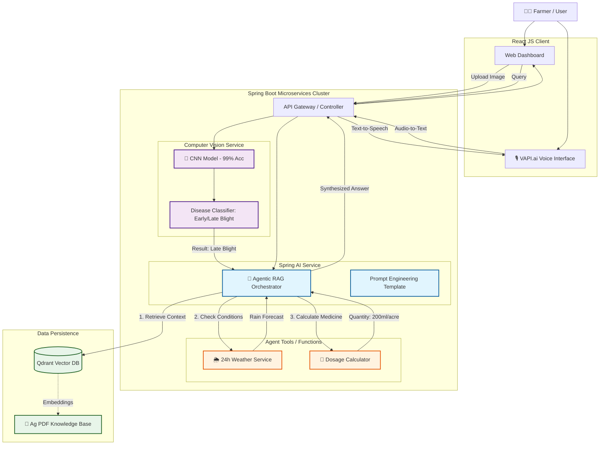

<h1 align="center">🌾 AI-Powered Kisan Assistance Platform 🤖</h1>

  <b>Agentic GenAI System for Smart & Sustainable Agriculture</b>

  

  An end-to-end <b>GenAI-powered agriculture intelligence platform</b> helping farmers
  detect crop diseases early, optimize pesticide usage, and make
  <b>timely, language-friendly decisions</b>.

  <a href="#-problem-statement">Problem</a> •
  <a href="#-solution">Solution</a> •
  <a href="#-key-features">Features</a> •
  <a href="#-system-architecture">Architecture</a> •
  <a href="#-tech-stack">Tech Stack</a> •
  <a href="#-how-to-run-high-level">Setup</a>

  
  
  
  
  

---

## 🚜 Problem Statement

Indian farmers face significant crop losses due to:

- ⏱️ **Late disease detection**
- 💊 **Incorrect pesticide dosage**
- 🌦️ **Ignoring weather risk during spraying**
- 🗣️ **Lack of advisory systems in regional languages**

❌ Existing solutions are fragmented, non-AI, and non-interactive.  
✅ Farmers need a **single intelligent assistant**, not multiple tools.

---

## 💡 Solution

The **AI-Powered Kisan Assistance Platform** delivers a unified, AI-driven solution that:

- 📸 Detects potato crop diseases directly from images
- 🧠 Generates **document-grounded treatment advice** using Agentic GenAI
- 💊 Calculates **exact pesticide dosage** based on field size
- 🌦️ Provides **weather-aware spray risk advisories**
- 🎙️ Enables **Hindi conversational support** via chat & voice AI

---

## ✨ Key Features

- 📸 Potato disease detection (Early & Late Blight) with **99%+ accuracy**
- 🧠 GenAI-based treatment recommendations using **Agentic RAG**
- 💊 Spray quantity calculation based on field size
- 🌦️ 24-hour weather-based disease risk prediction
- 💬 Memory-enabled AI chatbot for follow-up questions
- 🎙️ Hindi voice assistant using **VAPI.ai webhook-based tool calling**

---

## 🏆 Why This Is Different

✔️ Not a chatbot — an **Agentic AI system**  
✔️ Tool-calling + validation logic  
✔️ Domain-grounded agriculture intelligence  
✔️ Designed for real farmers, not demos
---

## 🛠️ Tech Stack

### Backend
- Spring Boot
- Spring AI
- Microservices
- REST APIs

### AI / ML
- CNN (Computer Vision)
- LLMs
- Agentic RAG

### Data & Infra
- Qdrant (Vector Database)
- Docker

### Frontend & Voice
- React.js
- VAPI.ai (Hindi Voice Assistant)

---

## 🏗️ System Architecture
Image Upload → CNN Disease Detection →  
Agentic RAG (Qdrant + LLM) →  
Treatment & Advisory APIs →  
React UI / Hindi Voice Assistant

---

## 🚀 How to Run (High-Level)

1. Clone the repository
2. Start backend services (Spring Boot)
3. Start frontend (React.js)
4. Run Qdrant using Docker
5. Access the application via browser

> ℹ️ Detailed setup steps can be added based on deployment environment.

---

## 🧠 System Architecture
## 🧠 System Architecture (Agentic RAG)

Unlike traditional chatbots, this platform uses an **Agentic RAG architecture** where
AI does not just answer questions — it **orchestrates tools** to:

- Validate pesticide dosage
- Check real-time weather conditions
- Retrieve scientific & agriculture documents
- Generate safe, explainable recommendations

## 🎯 Impact

This platform aims to:

- 🌾 Reduce crop losses
- 💊 Minimize chemical misuse
- 🌍 Promote sustainable farming
- 🗣️ Empower rural & non-English-speaking farmers with AI

---
## 👨‍💻 Author

**Nitin Kamlesh**  
Backend & GenAI Engineer

